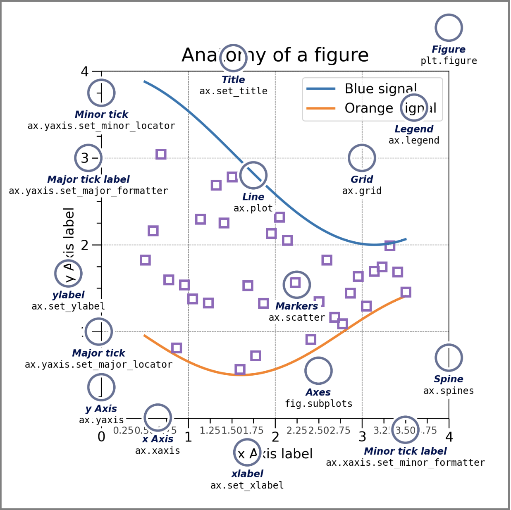

# Plots
This repo contains my customised style python based plots for NLP papers, and includes my reproduction for my favourite papers' plots.

## Table of Contents
- [Components](#components)

plot types:

Pairwise data: plot(x,y), scatter(x,y), bar(x,height)

More can be seen [here](https://matplotlib.org/stable/plot_types/index.html#plot-types)

## Components

Basically, there are two components you need to customize : first is the figure (Figure, Axes) which you might want to have multiple subplots in one figure. Another is everything inside an axes, you can customize each subplot(axes) one by one.
- Figure (plt.figure)
- Labelling
    - ylabel (ax.set_ylabel)
    - xlabel (ax.set_xlabel)
- Title  (ax.set_title)
- Legend (ax.legend)
- Grid  (ax.grid)
- Line  (ax.plot)
- Markers (ax.scatter)
- Axes (ax.subplots)
- Spine (ax.spines)
- Minor tick (ax.yaxis.set_minor_locator)
- Minor tick label (ax.xaxis.set)minor_formatter)
- Major tick (ax.yaxis.set_major_locator)
- Major tick label (ax.yaxis.set_major_formatter)
- y Axis (ax.yaxis)
- x Axis (ax.saxis)

## styling Artists
- Colors
- markers
- labels
- linewidth
- linestyle
    - '--'

